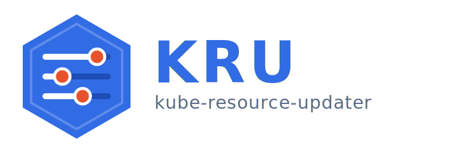

<p align="center">
  
</p>

<p align="center">
  <a href="https://github.com/mateus-gsilva/kube-resource-updater/actions/workflows/ci.yml"></a>
</p>

GitOps-driven, Prometheus-backed continuous right-sizing for Kubernetes workloads — without VPA touching pod specs.

## What it does

A sync **CronJob** queries Prometheus for actual CPU + memory usage of every opted-in `Deployment` / `StatefulSet` / `DaemonSet` / `CronJob`, computes recommended `requests` / `limits` from the configured percentile + margin + bounds, and writes one `ResourceOverride` Custom Resource per workload to a Git repo. The cluster-side **admission webhook** patches new pods at admission time using the matching CR. Operators see every change as a Merge Request before it lands; pods take the new values on the next rollout (or immediately, if `autoRollout` is enabled).

The sync also detects `OOMKilled` events on opted-in workloads and bumps memory limits ahead of the next OOM cycle — see the [OOM-aware](#oom-aware) section.

Write-back targets **GitLab** (merge requests — battle-tested in production) or **GitHub** (pull requests — validated against a live repo: branch push, PR open, and idempotent re-open/adoption). The provider is auto-detected from the repo URL, or forced via `config.gitProvider`.

## Why this exists

VPA's auto-applying recommendations are reviewable only after the fact (pod was already restarted with new resources). Helm chart authors don't always expose `resources:` knobs, and patching downstream charts breaks `helm upgrade`. This tool keeps Git as the source of truth, every change as a reviewable diff, and decouples the recommendation engine from the chart's value tree.

## Architecture (current)

| Component | What it does |
|---|---|
| **Sync CronJob** | Lists opted-in namespaces, computes recommendations from Prometheus, writes `ResourceOverride` CRs to a Git repo (direct push OR Merge Request). Detects `OOMKilled` events and bumps memory directly. |
| **Mutation admission webhook** | On every pod admission in opted-in namespaces, looks up matching `ResourceOverride` CRs by label selector + container name, and patches `pod.spec.containers[*].resources`. |
| **Validating admission webhook** | Rejects new CRs whose selector overlaps an existing CR + shares a container name (would result in non-deterministic admission patches). |
| **In-process cert reconciler** | Generates and rotates a self-signed CA + serving cert; patches the `MutatingWebhookConfiguration` / `ValidatingWebhookConfiguration` `caBundle`. No cert-manager dependency. |
| **Auto-rollout watcher** | When a CR's resources change and `autoRollout` is enabled, stamps `kubectl.kubernetes.io/restartedAt` on the workload's PodTemplate, triggering a rolling restart. |
| **`ResourceOverride` CRD** | `kube-resource-updater.io/v1`. Holds `selector.matchLabels` + per-container `requests` / `limits` + audit annotations (`oom-floor.<c>`, `oom-last-event.<c>`, `oom-boost-history.<c>`, `managed-by`). |

## Quick start

1. **Install the chart** straight from GHCR in its own namespace (it manages its own RBAC + CRD + webhook certs). The default `image.repository` already points at the published image — no image override needed.

```bash
helm install kube-resource-updater \
  oci://ghcr.io/mateus-gsilva/charts/kube-resource-updater --version 0.1.1 \
  --namespace kube-resource-updater --create-namespace \
  --set config.prometheusUrl=http://prometheus-operated.monitoring.svc.cluster.local:9090 \
  --set git.token=$GIT_TOKEN \
  --set config.crWriteback.repoUrl=https://gitlab.example.com/infra/cluster-gitops.git \
  --set config.crWriteback.path=manifests/kube-resource-updater
```

   Image: `ghcr.io/mateus-gsilva/kube-resource-updater` · Chart: `oci://ghcr.io/mateus-gsilva/charts/kube-resource-updater`. Both are public on GHCR.

2. **Opt a namespace in** by annotation:

```bash
kubectl annotate namespace my-app kube-resource-updater.enabled=true
```

3. The next CronJob run discovers every `Deployment` / `StatefulSet` / `DaemonSet` / `CronJob` in `my-app`, queries Prometheus, and writes a CR — the CR's selector is derived from each workload's pod-template labels. A Merge Request is opened on the gitops repo with the diff.

4. After merge + ArgoCD/Flux sync, new pods in `my-app` admit with the patched resources.

> See [`examples/`](examples/) for a generic ArgoCD `Application` manifest
> and a fully-annotated opt-in `Namespace` example covering the per-namespace
> + per-workload override knobs.

## OOM-aware

Workloads that `OOMKilled` at limit `X` would otherwise loop forever — the Prometheus history caps at `X` so the percentile recommendation stays at `X`. The sync detects the OOM via `pod.status.containerStatuses[*].lastState.terminated.reason` and bumps the limit:

```
new_limit = trap × oomBumpFactor   (default 1.5)
```

Per-container annotations on the CR record the floor (sticky), last-event timestamp (dedupe), and human-readable history (audit). Convergence example: `100Mi → 150 → 225 → 338 → 507 → 760 Mi` in 5 syncs.

Latency is bounded by `cronjob.schedule` (default 6h). Operators on OOM-heavy clusters crank to `*/10 * * * *` and either enable GitLab auto-merge or set `config.createMr: false`. See [docs/reference.md#oom-aware-bumps](docs/reference.md#oom-aware-bumps).

## Per-workload overrides

Anything from the chart's `config:` block is overridable per-namespace and per-workload via `kube-resource-updater.<key>` annotations (camelCase preserved). Resolution: **workload > namespace > helm default**.

```yaml
# Namespace
metadata:
  annotations:
    kube-resource-updater.enabled: "true"
    kube-resource-updater.cpuPercentile: "0.95"           # default override
    kube-resource-updater.autoRollout: "true"

# Workload
metadata:
  annotations:
    kube-resource-updater.skipContainers: "istio-proxy"   # don't touch sidecar
    kube-resource-updater.maxMemoryLimitMi: "4096"        # workload-specific ceiling
    kube-resource-updater.oomFloorEnabled: "false"        # bumps are one-shot for this one
```

Unknown keys log a typo warning at sync time. See the [annotations reference](docs/reference.md#annotations-reference) for the full catalogue.

## Local development

```bash
# Install deps
pip install -r requirements.txt

# Configure .env with Prometheus URL + GitLab token (for MR open)
cat > .env <<EOF
PROMETHEUS_URL_<CLUSTER>=https://prometheus.example.com
GITLAB_TOKEN=glpat-...
CR_WRITEBACK_REPO_URL=https://gitlab.example.com/infra/cluster-gitops.git
CR_WRITEBACK_PATH=manifests/kube-resource-updater
EOF

# Dry-run sync against the live cluster (no git writes)
DRY_RUN=true python3 main.py sync

# QA: ~1,250 unit assertions across all features
python3 tools/qa_params.py
```

## Documentation

- [`docs/reference.md`](docs/reference.md) — full reference: annotations, config keys, Prometheus queries, RBAC, helm values.
- [`docs/webhook-migration.md`](docs/webhook-migration.md) — design doc for the webhook + CRD architecture.
- [`charts/kube-resource-updater/README.md`](charts/kube-resource-updater/README.md) — chart install + key values.
- [`ROADMAP.md`](ROADMAP.md) — planned features and known gaps.
- [`CHANGELOG.md`](CHANGELOG.md) — release history.

## Contributing

See [CONTRIBUTING.md](CONTRIBUTING.md) for the local-dev setup, the QA
contract (every change ships with an assert), the chart-bump release
process, and the code-style expectations (PEP 604 type hints, comment
*why* not *what*, tag-first log lines).

## License

[Apache License 2.0](LICENSE). Actively developed. The image and the Helm chart
are published to GHCR on every release (see [Quick start](#quick-start)); an
Artifact Hub listing is planned. [ROADMAP.md](ROADMAP.md) tracks the remaining
items.
